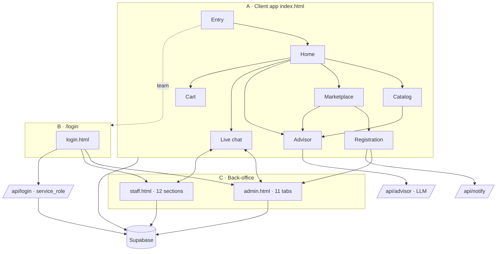

# 02 · Areas & Responsibilities

The product is three surfaces sharing one Supabase backend and one design language:

- **A. Client app** (`index.html`) — public, for visitors/prospects.
- **B. Unified login** (`login.html`, route `/login`) — for team members.
- **C. Back‑office** — **Admin panel** (`admin.html`) and **Staff cabinet** (`staff.html`).

Priority legend for mobile v1: **MUST** (core value) · **NICE** (valuable, can follow) · **DEMO** (demo‑only / defer).

---

## A. CLIENT APP (`index.html`)

The client app is itself a set of feature areas navigated by an in‑file router (`go(page)` → `render()`), a **bottom tab bar** (`.botbar`), a top header (logo, language, cart, account) and a simulated **VPN bar**.

### A1. Entry / Onboarding
- **Purpose:** get an anonymous visitor into the app as a "guest".
- **Owns:** the first screen; capturing name + contact; setting the guest session (`localStorage bc_guest`, `window.USER`). Does **not** own real auth (there is none for guests) — team login is delegated to `/login`.
- **Screens:** `entry` (guest login), links out to `/login` ("Войти в систему · у меня есть аккаунт").
- **Data:** writes `visitors` (device profile, **consent‑gated**) and an `events` row `type=entry`; stores name/contact locally.
- **Rules:** name required to continue; contact optional but captured; language selectable (RU/EN/HY). No password.
- **Dependencies:** consent state (tracking gated), `/login` for team.
- **Priority:** **MUST** (guest entry) — but reconsider whether mobile wants a real account here.

### A2. Home
- **Purpose:** hub — greet the user, search, and route to catalog areas + AI advisor.
- **Owns:** the dashboard of section cards (iGaming Solutions, Platforms, Products, Backoffice/BME, Regional/Jurisdiction, Payment methods), the search entry, the AI‑advisor call‑to‑action, and a **"Быстрый доступ" / quick‑access** grid (Partner API, Live, Sports, Casino…), plus the **guest "Выйти"** link.
- **Screens:** `home`.
- **Data:** reads nothing critical (static catalog); may fire `events type=page`.
- **Rules:** greeting shows `window.USER` name when guest logged in; "Выйти" only shows for a logged‑in guest.
- **Dependencies:** Catalog areas, AI advisor, Cart, Chat.
- **Priority:** **MUST**.

### A3. Catalog (iGaming Solutions / Platforms / Products / Regional / Payments / Backoffice)
- **Purpose:** present the **static** BetConstruct offering in depth.
- **Owns:** the content taxonomy: `SOL` (Turnkey/Crypto/White Label/API iGaming), `PLAT` (CMS Pro, SpringBuilderX…), `PCAT` (product categories), `PACKS` (priced bundles), `BME`, `REGIONS`, `LICENSES`, `PAY`. Rendering, expand/collapse, "Ask AI" and "Discuss with manager" CTAs.
- **Screens:** `igaming` (Solutions), `catalog` (Products), `regional` (Regions & Licenses), and section detail views.
- **Data:** all **static in code** (no DB) — this is ground truth content to migrate.
- **Rules:** accordions; each solution has intro + blocks; prices are literal strings (e.g. "White Label · Curaçao — €19 900").
- **Dependencies:** AI advisor (grounding data), Chat.
- **Priority:** **MUST** (content) — this is the catalog the whole product sells.

### A4. Marketplace (vendors)
- **Purpose:** list **third‑party vendor products** (from approved applications) with filtering.
- **Owns:** vendor cards with **badge** (New / Approved by BetConstruct / Partner), category filter chips (Все/Payment/Slot/Games…), metrics (impressions/"показов"), "+ В корзину" and "Демо" actions; the "Разместить продукт" and "Аффилейт/Маркетинг" registration entry cards.
- **Screens:** `market`.
- **Data:** reads `vendors` (active) + `applications` (approved) from Supabase; writes `leads` on demo/cart; increments impressions/clicks (RPC `bump_impression`/`bump_click`).
- **Rules:** badge → visual style; only `active`/approved shown; filter by category; a click on Demo creates a `lead source=demo_request`.
- **Dependencies:** Registration (source of vendors), Cart, Leads, Chat.
- **Priority:** **MUST**.

### A5. AI Advisor
- **Purpose:** turn a free‑text business need into a ready configuration.
- **Owns:** the advisor screen (textarea + "Получить рекомендацию"), building the grounding **knowledge base** (`buildKB()` = BetConstruct catalog + marketplace vendors + partners), calling `POST /api/advisor`, rendering the answer, and a **local fallback** (`aiLocal`) when the endpoint fails.
- **Screens:** `advise`.
- **Data:** reads catalog (static) + `vendors`/`applications`; writes `events type=ai`; posts to `/api/advisor` (LLM).
- **Rules:** answer must be grounded only in the provided data; ends with a disclaimer ("Предварительная рекомендация…"); temperature ~0.3–0.4; short structured answers; language follows the user.
- **Dependencies:** Catalog + Marketplace (grounding), `/api/advisor` (LLM — provider undecided).
- **Priority:** **MUST** (differentiator) — but needs a working LLM key.

### A6. Registration (partner / vendor / affiliate / buyer)
- **Purpose:** capture a company/product application.
- **Owns:** role selector (buyer/game/pay/affiliate…), the dynamic form (`regFields()` by role), submit (`submitReg` → insert `applications`), and a link to `/login` ("Уже есть аккаунт? Войти").
- **Screens:** `register`.
- **Data:** writes `applications` (company, kind, category, product_name, contact, regions, description, value_prop, …, `portal_pass` field exists but portal flow removed); fires `notifyApp` (POST `/api/notify`).
- **Rules:** email required; role changes the visible fields; on success shows a confirmation card.
- **Dependencies:** Admin "Applications" (moderates these), `/api/notify`.
- **Priority:** **MUST**.

### A7. Interest Cart
- **Purpose:** let a visitor collect products of interest and send them as one lead.
- **Owns:** the client‑side cart (localStorage), cart screen, and "submit interest" → `leads source=cart`.
- **Screens:** cart view (header cart icon).
- **Data:** cart local; writes `leads` + `notifyApp` on submit.
- **Priority:** **NICE**.

### A8. Live Chat (visitor ↔ manager)
- **Purpose:** real‑time (polled) chat with a manager, plus background nudge.
- **Owns:** chat screen, thread creation (`threads kind=visitor`, `guest_key`=anonId), sending text/files (Supabase Storage `uploads`), polling messages (~3.5s), and a **background watcher** (~6s) that toasts "Менеджер написал вам" when a staff reply arrives while chat is closed. The opener shows a **mock** greeting from "Ани".
- **Screens:** `chat`.
- **Data:** reads/writes `threads`, `thread_messages`; uploads to Storage.
- **Rules:** guest identified by `guestKey()` (anonId or 'g_anon'); staff replies have `role=staff`.
- **Dependencies:** Back‑office Chat (the other side), Storage.
- **Priority:** **MUST** (but mobile should use push, not polling).

### A9. More / Menu
- **Purpose:** overflow menu — external product links, Loyalty, and **Выйти / сменить пользователя** (guest logout).
- **Screens:** `more`, `loyalty`.
- **Priority:** **NICE**.

### A10. Agreement signing (deep link)
- **Purpose:** a partner opens `?sign=<id>` to view/sign an agreement.
- **Owns:** the `sign` screen (the only URL‑routed screen: `?sign=`), loading the agreement, signing.
- **Data:** reads/writes `agreements`.
- **Priority:** **NICE** (tie‑in with agreements) — mobile: a deep link.

### A11. Privacy Policy (`privacy.html`, standalone)
- **Purpose:** GDPR privacy policy page (RU/EN toggle), linked from the consent banner.
- **Priority:** **MUST** (store requirement) — but content needs legal review.

---

## B. UNIFIED LOGIN (`login.html`, route `/login`)
- **Purpose:** one sign‑in for **admins and staff**; auto‑detect role server‑side and route.
- **Owns:** the login form (email/login + password, show/hide, RU/EN/HY), calling `POST /api/login` (no `kind` → auto), and routing: `dest=admin` → set `sessionStorage bc_admin` → `/admin.html`; `dest=staff` → set `bc_staff` → `/staff.html`. Link out to the client app for regular users.
- **Owns NOT:** the actual cabinets (admin/staff own themselves); password storage (server).
- **Data:** `POST /api/login` only.
- **Rules:** admin identified via env `ADMIN_LOGINS` **or** a `staff` row with role Админ; staff via `staff` login+active+pass. Errors: "Неверный логин или пароль" / network error. Passwords verified by service_role; never read client‑side.
- **Dependencies:** `/api/login`, admin.html, staff.html.
- **Priority:** **MUST**.

---

## C. BACK‑OFFICE

### C‑ADMIN (`admin.html`) — 11 tabs
One‑line purpose each; all share the top bar (wordmark, ADMIN chip, language RU/EN/HY, **account menu** with "Сменить аккаунт"/"Выйти"), a scrollable tab strip, and a `render()` router. Login screen when not authenticated.

| Tab (id) | Purpose | Owns / decides | Reads/Writes | Priority |
|---|---|---|---|---|
| **Дашборд** (`dash`) | KPI overview | online count, new applications, leads, funnel summary, "кто в сети", tasks | staff, applications, leads, deals, events, vendors, tasks | MUST |
| **Заявки на продукт** (`mod`) | Moderate applications | status transitions (pending→approved/partner/new/rejected), publish vendor, portal activation, password reset request handling | applications, vendors | MUST |
| **Сотрудники** (`staff`) | Team management | create staff + issue login/pass, set role, toggle access, reset password, open a staff's cabinet, presence | staff | MUST |
| **Аккаунты** (`accts`) | Client/partner registry | who owns which account, import (CSV), omnichannel comms | accounts, contacts, comm_messages | NICE |
| **CRM** (`crm`) | Deals pipeline | 6 stages + 7‑step flow, responsible-by-role assignment, deal detail, comms per deal | deals, leads, accounts, comm_messages | MUST |
| **Соглашения** (`agr`) | Agreements | draft → sign → pay, link to deal, signing link | agreements | NICE |
| **Задачи** (`tasks`) | Tasks / resource requests | title/dept/assignee/priority/status | tasks, staff | NICE |
| **Чат** (`chat`) | Live chat + channels | visitor chat (the manager side), kickoff & internal channels, polling ~3.5s | threads, thread_messages, Storage | MUST |
| **Документы** (`docs`) | File registry | uploads to Storage bucket `uploads` | documents, Storage | NICE |
| **Аналитика** (`stats`) | Analytics | marketplace funnel (show→click→lead), visitor paths (by device code, merged by contact), shift ranking | events, vendors, leads, staff, visitors | NICE |
| **Контент** (`content`) | Content management | banners/content flags | content_flags, banners | DEMO |

Cross‑cutting admin logic: **XSS escaping** of all visitor‑supplied text (`esc()`), the **hardcoded `ADMINS` fallback** (client‑side, being retired), and a language‑switch `translateDOM()`.

### C‑STAFF (`staff.html`) — 12 sections
The staff cabinet is a **role‑scoped subset** of the admin view (a sales rep's own world). Sections (`TABS`): **Обзор, Онлайн** (who's on site + chat), **Мои лиды, Мои клиенты, Мой CRM, Соглашения, Задачи, Документы, Смена** (shifts), **Чаты, Аналитика, Профиль**.
- **Owns:** the individual staff member's leads, deals, agreements, tasks, chats, shifts, profile.
- **Owns NOT:** application moderation, team management, content — those are admin‑only.
- **Data:** same tables as admin, filtered to the logged‑in staff (`S`).
- **Priority:** **MUST** (Обзор/Онлайн/Мои лиды/Мой CRM/Чаты), rest **NICE**.

---

## Dependency diagram

**Reading:** the client app feeds the back‑office (applications → moderation → vendors; visits/chat/leads → CRM); the back‑office serves the client (published vendors, manager chat replies); both sit on one Supabase DB; login and advisor go through serverless functions.
