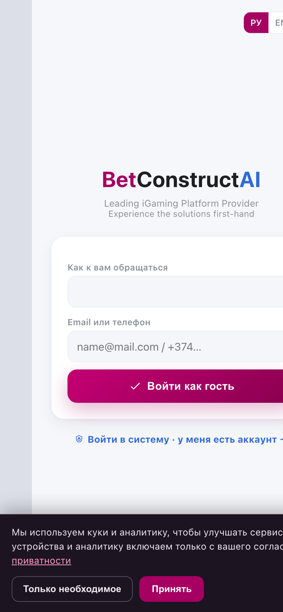
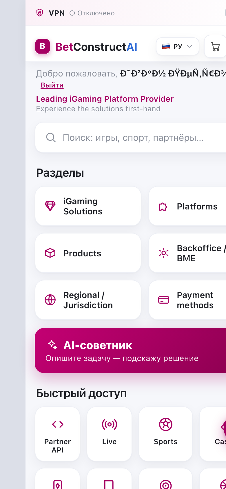
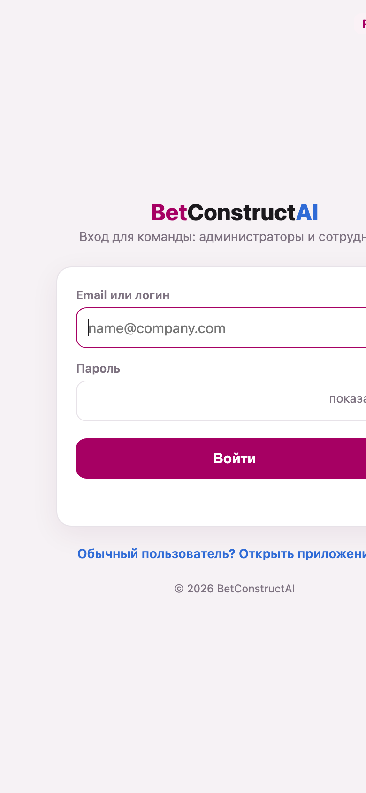
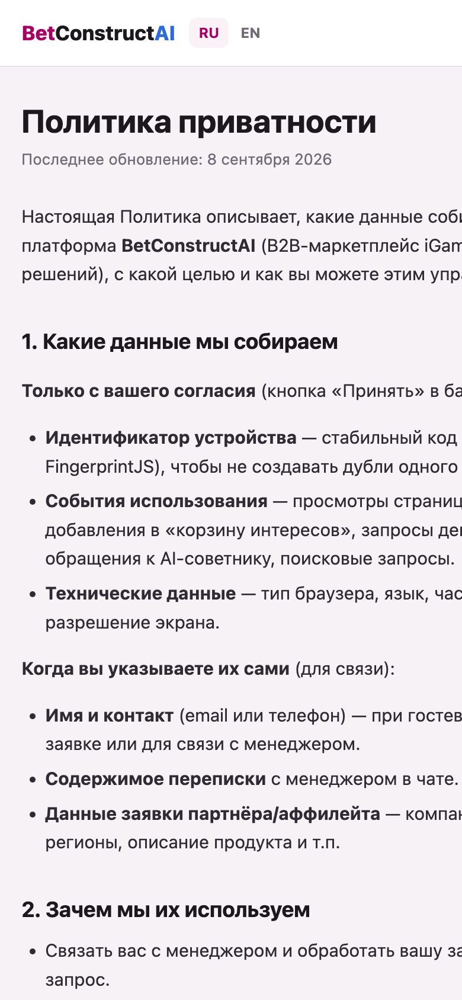
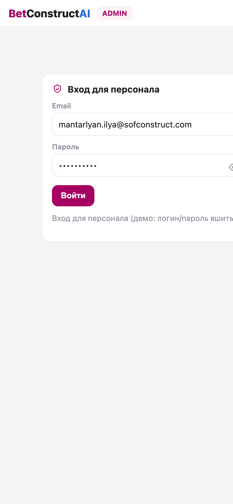
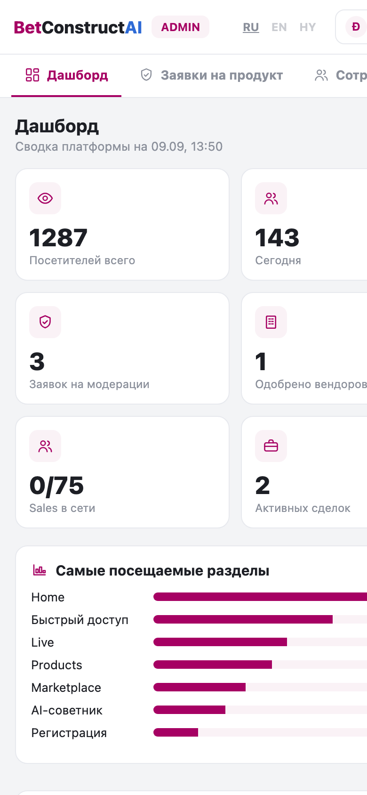
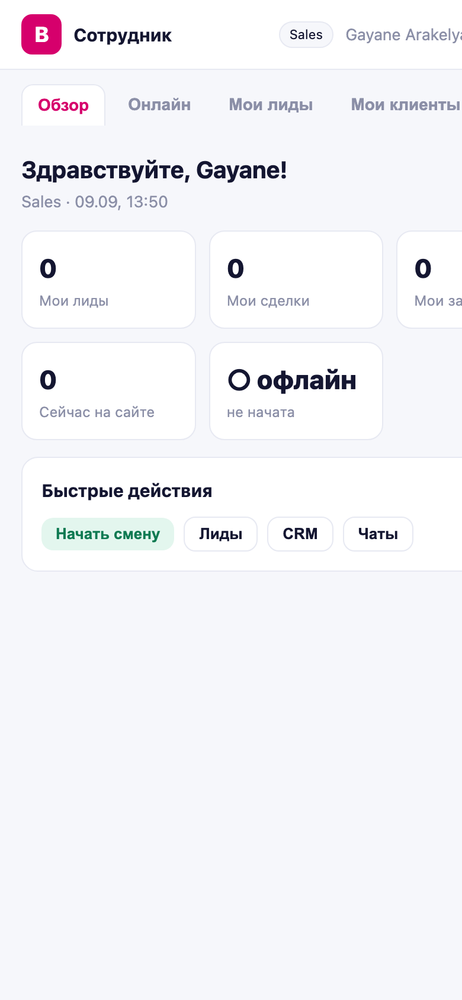

# 03 · Screens & Flows

Screenshots were captured with headless Chrome at **390 × 844** (iPhone‑class portrait), device scale 2×. They live in `./screenshots/`. Only a handful of screens have a URL; most are JS‑router views inside one HTML file, so the inner screens are described richly rather than each captured.

---

## Screen inventory

### A · Client app (`index.html`) — router views (`go(page)`)
| # | View id | Name | How reached | Captured |
|---|---|---|---|---|
| 1 | `entry` | Guest entry / onboarding | app open (default) | ✅ `client-entry.png` |
| 2 | `home` | Home / hub | after guest enter | ✅ `client-home.png` |
| 3 | `igaming` | iGaming Solutions | Home → Solutions | — |
| 4 | `catalog` | Products catalog | Home → Products / bottom tab | — |
| 5 | `market` | Marketplace (vendors) | Home → Marketplace / bottom tab | — |
| 6 | `advise` | AI Advisor | Home → "Спросить AI" | — |
| 7 | `regional` | Regions & Licenses | Home → Regional | — |
| 8 | `register` | Registration form | Marketplace → "Разместить продукт" / "Уже есть аккаунт?" area | — |
| 9 | `chat` | Live chat with manager | header/bottom chat icon | — |
| 10 | `cart` | Interest cart | header cart icon | — |
| 11 | `more` | More / overflow menu | bottom tab "Ещё" | — |
| 12 | `loyalty` | Loyalty | More → Loyalty | — |
| 13 | `sign` | Agreement signing | deep link `?sign=<id>` | — |

### B · Standalone HTML pages (have real URLs)
| # | File | Route | Name | Captured |
|---|---|---|---|---|
| 14 | `login.html` | `/login` | Unified login (admin+staff) | ✅ `login-unified.png` |
| 15 | `privacy.html` | `/privacy.html` | Privacy Policy (RU/EN) | ✅ `privacy.png` |

### C · Back‑office
| # | File | View | Name | Captured |
|---|---|---|---|---|
| 16 | `admin.html` | login gate | Admin login | ✅ `admin-login.png` |
| 17 | `admin.html` | `dash` | Admin dashboard | ✅ `admin-dashboard.png` |
| 18–27 | `admin.html` | `mod/staff/accts/crm/agr/tasks/chat/docs/stats/content` | Admin tabs (10 more) | — |
| 28 | `staff.html` | cabinet | Staff cabinet (12 sections) | ✅ `staff-cabinet.png` |

> **Note for the mobile team:** items 3–13 and 18–27 are *views inside a single file*, switched by JS with **no distinct URL** — so they can't be deep‑linked or screenshotted by navigation. Treat the descriptions below as the spec for each.

---

## Navigation tree

```
App open
└─ index.html
   ├─ entry (guest login)  ──"Войти в систему"──▶  /login (login.html)
   │                                                 ├─ dest=admin ▶ admin.html
   │                                                 └─ dest=staff ▶ staff.html
   └─ home  (after guest enter)
      ├─ bottom tab: Главная → home
      ├─ bottom tab: Каталог → catalog ─┬─ solution detail
      │                                 └─ "Ask AI" → advise
      ├─ bottom tab: Маркет → market ──┬─ vendor card → cart / demo(lead)
      │                                └─ "Разместить продукт" → register
      ├─ bottom tab: AI → advise → (POST /api/advisor) → recommendation
      ├─ bottom tab: Ещё → more ─┬─ loyalty
      │                          └─ Выйти (guest logout → entry)
      ├─ header: cart → cart → submit interest (lead)
      ├─ header: chat → chat → (polling) manager thread
      ├─ header: language RU/EN/HY
      └─ Solutions / Regional / Payments cards → igaming / regional

deep link: index.html?sign=<agreementId> → sign screen
```

Admin/staff internal navigation is a horizontal tab strip; no nested URLs.

---

## User flows (numbered)

### Flow 1 — Guest enters and gets an AI recommendation (client happy path)
1. App opens on **`entry`** (`client-entry.png`): logo, "Войдите, чтобы начать", name field, contact field, language, "Войти как гость".
2. User types a name (+ optional contact), taps **Войти как гость**.
   - Writes `visitors` (if consent given) + `events{type:entry}`; sets `localStorage bc_guest`, `window.USER`.
3. Lands on **`home`** (`client-home.png`): greeting with name, search, section cards, quick‑access grid, AI CTA.
4. Taps **AI advisor** → **`advise`**; types a business need; taps **"Получить рекомендацию"**.
5. Client builds KB (catalog + vendors) → `POST /api/advisor` → renders a grounded recommendation (or `aiLocal` fallback if the endpoint fails). Fires `events{type:ai}`.
6. From the recommendation the user can jump to a solution/vendor, **add to cart**, or **chat with a manager**.

### Flow 2 — Browse marketplace → request demo → becomes a lead
1. Home → **`market`** (Marketplace).
2. Filter by category chip (Все / Payment / Slot / Games…).
3. On a vendor card tap **Демо** (or **+ В корзину**).
4. Creates a `lead{source:'demo_request'|'cart', visitor_name, contact}` and `notifyApp`; increments vendor impressions/clicks.
5. Lead surfaces in Admin **CRM/Dashboard** and in the responsible Staff cabinet's **Мои лиды**.

### Flow 3 — Register a product/partner application
1. Marketplace → **"Разместить продукт"** (or Register entry) → **`register`**.
2. Pick a role (buyer / game / pay / affiliate…); form fields change (`regFields()`).
3. Fill company, product, category, contact (email required), regions, description.
4. Submit → insert `applications{status:'pending'}` + `notifyApp`; confirmation card shown.
5. Admin **Заявки на продукт** (`mod`) moderates → approve → publishes a `vendor` (badge) that then appears in the Marketplace.

### Flow 4 — Live chat visitor ↔ manager
1. Client taps chat → **`chat`**; a **mock** greeting from "Ани" appears.
2. First message creates `threads{kind:'visitor', guest_key:anonId}`; text/files saved to `thread_messages` (+ Storage `uploads`).
3. Client polls messages ~3.5s. If the user closes chat, a background watcher (~6s) toasts **"Менеджер написал вам"** when a `role:'staff'` reply lands.
4. On the other side: Admin/Staff **Чат** lists visitor threads, replies as `role:'staff'`.

### Flow 5 — Team member logs in (unified /login)
1. Open **`/login`** (`login-unified.png`): email/login + password (+show/hide), language.
2. Submit → `POST /api/login {login, pass}` (auto mode).
3. Server checks admin first (env `ADMIN_LOGINS` or a `staff` row role=Админ), then staff (`staff` row, active, pass).
4. Response:
   - `{ok:true, dest:'admin', profile}` → set `sessionStorage bc_admin` → redirect **admin.html**.
   - `{ok:true, dest:'staff', profile}` → set `bc_staff` (JSON) → redirect **staff.html**.
   - `{ok:false}` → error **"Неверный логин или пароль"**.
5. Regular users instead follow "Открыть приложение →" back to `index.html`.

### Flow 6 — Admin moderates and manages a deal
1. `/login` → **admin.html** → **Дашборд** (`admin-dashboard.png`): KPIs, who's online, new applications/leads, funnel.
2. **Заявки** → open an application → approve → publish vendor.
3. **CRM** → a lead becomes a **deal** (`BC-####`); move through 6 stages / 7‑step flow; assign responsible people by role.
4. **Соглашения** → draft agreement tied to the deal → send signing link (`index.html?sign=<id>`) → sign → mark paid.
5. **Задачи / Документы / Чат / Аналитика** as needed.

### Flow 7 — Staff daily use (cabinet)
1. `/login` → **staff.html** (`staff-cabinet.png`): **Обзор**, **Онлайн** (who's on site + chat), **Мои лиды**, **Мой CRM**, **Чаты**, **Смена**, **Профиль**.
2. Everything is scoped to the logged‑in staff member (`S`); no moderation/team/content tabs.

### Flow 8 — Consent / privacy (GDPR)
1. On first client load a **consent banner** appears (dark `#1c1420`, pink `#ff9ecb` accents).
2. Until the user taps **Принять**, FingerprintJS and `track()` analytics are **off**.
3. "Политика конфиденциальности" opens **`privacy.html`** (`privacy.png`, RU/EN toggle).

---

## Screenshots (390 × 844)

Guest entry · Home · Unified login:

  

Privacy · Admin login · Admin dashboard:

  

Staff cabinet:



> The remaining inner screens (catalog, marketplace, advisor, register, chat, cart, and the 10 non‑dashboard admin tabs) have no standalone URL and were not individually captured; see the per‑screen descriptions above and the component inventory in `design/THEME.md`.
